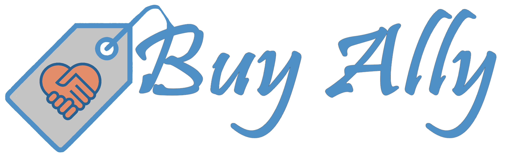
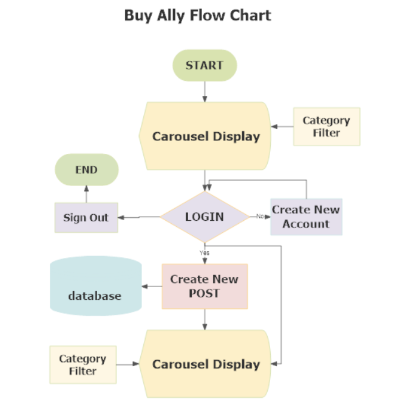
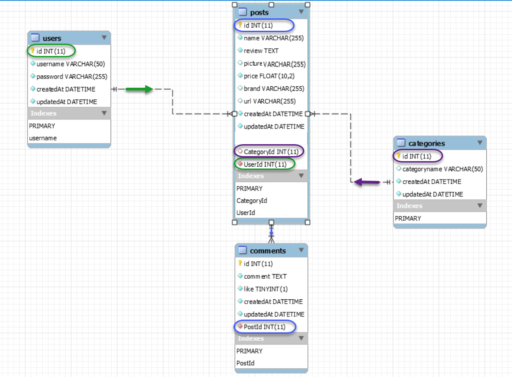
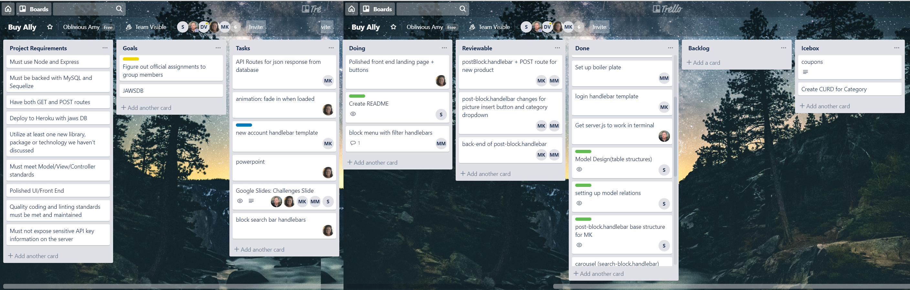

# Buy Ally


## Overview
Buy Ally allows user to post reviews/Picture/Video and URL about the purchases they have done
and the items they think other users may like to buy.
last 5 uploads are always visible on the site. User can use Category filter to see slides of a particular category.
Posts are allowed only if user has an account with us. That provides an extra layer of security.

## Power Point Presentation
https://docs.google.com/presentation/d/1r2UtHDPnpRFPflcvSUkL7POaqVAYr-CWHcD1DuF2Bqo/edit#slide=id.g559e7814a1_0_0

## npm Dependencies
    dotenv
    express
    express-handlebars
    express-session
    passport
    chai
    chai-http
    multer

## Database
    MySQL


## Installation Guide

### Fork or Clone Project
```sh
$ git clone https://github.com/michjmend/PROJECT2.git
```

### Create Database buyallyDB
   * Make sure you're in the folder where schema.sql is (go to models folder for this project).

   * Start MySQL command line tool and login: `mysql -u root -p`.

   * With the `mysql>` command line tool running, enter the command `source schema.sql`. This will run the schema file, you'll be creating your database.

### Install npm
This project uses [node](http://nodejs.org) and [npm](https://npmjs.com). Check them out if you don't have them locally installed.
All the dependencies are already install.

```sh
$ npm install
```

### Run Project
```sh
$ node server.js
```

### Heroku link
https://codingprojecttwo.herokuapp.com/


#### Only for Dev and test environment
   * From Command Prompt insert the entries defined in `seeds.sql` by running the file: `source seeds.sql`.

   * You may want to import records in post table from seeddata.csv using MySQL Workbench.

   * Close out of the MySQL command line tool: `exit`.


# PROJECT WORK FLOW

## Requirements
* Use a Node and Express Web Server;
* Be backed by a MySQL Database an ORM (not necessarily Sequelize);
* Have both GET and POST routes for retrieving and adding new data;
* Be deployed using Heroku (with Data);
* Utilize at least one new library, package, or technology that we haven’t discussed;
* Have a polished frontend / UI;
* Have folder structure that meets MVC Paradigm;
* Meet good quality coding standards (indentation, scoping, naming).
* Must not expose sensitive API key information on the server, see Protecting-API-Keys-In-Node.md

## Why Buy Ally
* Need to visit multiple sites to look for a perticular style.
* It is time consuming.
* giving user a one stop quick shop expirience.

## Brain storming
  * Who is your target audience?
      All users searching for best product (price, size, fit, option, store)
  * What is the problem that the product will address?
      Buyers desire finding products from multiple locations that fit their search query, this app will provide one stop shopping.
  * What is the primary goal of the product?
      App will allow buyers to review products and post own products.
      click on the URL to do quick shopping of the liked items.

## Flowchart


## ER Diagram
Used Star Schema for Database design


## Organize/Prioritize
Team work is done collaboratively using Trello’s boards, lists and cards.
Trello was a big help when it comes to organize and prioritize project.
Project is based on Agile Methodology. We had 2 sprints of 3 days each.
Each Card represents a User Story.


## Contributors
This project exists thanks to all the people who contribute.
<a href="contributors"></a>


## License
[Full Stack Developers @RUTGERS](LICENSE) © Andrew Tirpok/Kristen De La Rosa/Sushmita Yande/Michael Kang/Michelle Mendieta

